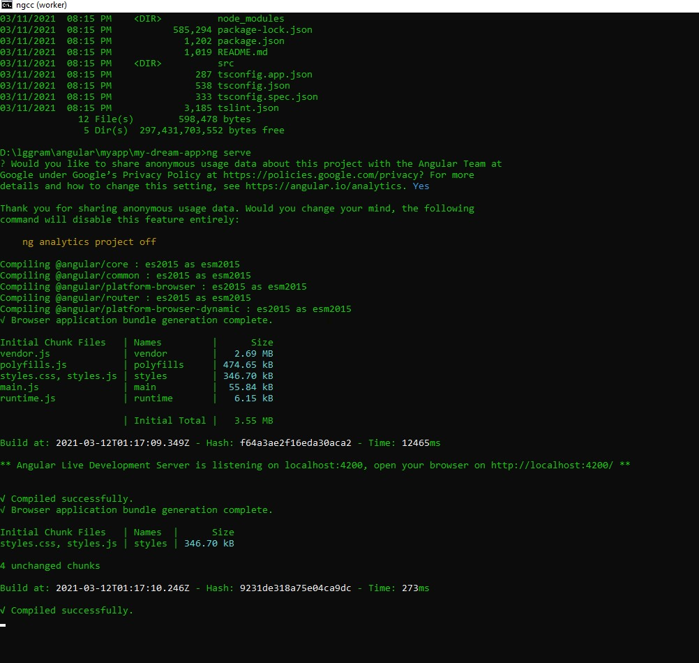
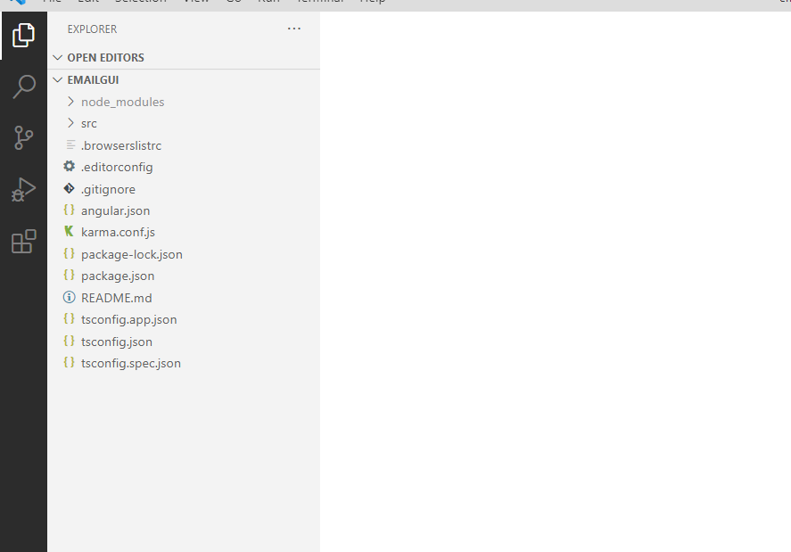
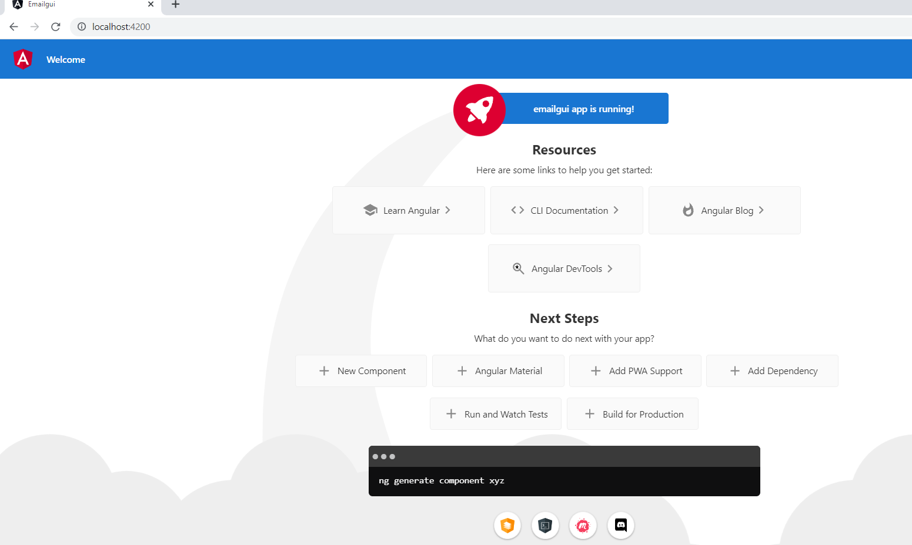

# Installation and Environment Setup


### How to install Node and NPM

- https://nodejs.org/en/
- go for latest stable version : https://nodejs.org/dist/v14.16.0/node-v14.16.0-x64.msi
- once installation is done you can check version:
```text
C:\Users\offic>npm -v
6.14.15

C:\Users\offic>node -v
v14.18.1


```
- NPM is installed alongwith nodeJS by default.

### How to install angular CLI

- go to here: https://cli.angular.io/
  
- run following commands:
```text
npm install -g @angular/cli

Note: -g: global
After cli is installed, we can check as follows: 

C:\Users\offic>ng
Available Commands:
  add Adds support for an external library to your project.
  analytics Configures the gathering of Angular CLI usage metrics. See https://angular.io/cli/usage-analytics-gathering.
  build (b) Compiles an Angular app into an output directory named dist/ at the given output path. Must be executed from within a workspace directory.
  deploy Invokes the deploy builder for a specified project or for the default project in the workspace.
  config Retrieves or sets Angular configuration values in the angular.json file for the workspace.
 

For more detailed help run "ng [command name] --help"

cd D:\lggram\angular\myapp

```
### Install first angular App
Run below commands to install new app: 
```text
ng new emailgui
cd emailgui
ng serve
```
**Note**: 
```text
? Would you like to add Angular routing? (y/N) y

- it will do all routing configurations and  helps open different pages.
```

#### logs:
```text
Microsoft Windows [Version 10.0.19043.1237]
(c) Microsoft Corporation. All rights reserved.

D:\lggram\angular\myapp>ng new emailgui
? Would you like to add Angular routing? Yes
? Which stylesheet format would you like to use? CSS

CREATE emailgui/angular.json (3051 bytes)
CREATE emailgui/package.json (1072 bytes)
CREATE emailgui/README.md (1055 bytes)
CREATE emailgui/tsconfig.json (783 bytes)
CREATE emailgui/.editorconfig (274 bytes)
CREATE emailgui/.gitignore (604 bytes)
CREATE emailgui/.browserslistrc (703 bytes)
CREATE emailgui/karma.conf.js (1425 bytes)
CREATE emailgui/tsconfig.app.json (287 bytes)
CREATE emailgui/tsconfig.spec.json (333 bytes)
CREATE emailgui/src/favicon.ico (948 bytes)
CREATE emailgui/src/index.html (294 bytes)
CREATE emailgui/src/main.ts (372 bytes)
CREATE emailgui/src/polyfills.ts (2820 bytes)
CREATE emailgui/src/styles.css (80 bytes)
CREATE emailgui/src/test.ts (788 bytes)
CREATE emailgui/src/assets/.gitkeep (0 bytes)
CREATE emailgui/src/environments/environment.prod.ts (51 bytes)
CREATE emailgui/src/environments/environment.ts (658 bytes)
CREATE emailgui/src/app/app-routing.module.ts (245 bytes)
CREATE emailgui/src/app/app.module.ts (393 bytes)
CREATE emailgui/src/app/app.component.html (24617 bytes)
CREATE emailgui/src/app/app.component.spec.ts (1079 bytes)
CREATE emailgui/src/app/app.component.ts (212 bytes)
CREATE emailgui/src/app/app.component.css (0 bytes)
√ Packages installed successfully.
warning: LF will be replaced by CRLF in .browserslistrc.
The file will have its original line endings in your working directory
warning: LF will be replaced by CRLF in .editorconfig.
The file will have its original line endings in your working directory
warning: LF will be replaced by CRLF in .gitignore.
The file will have its original line endings in your working directory
warning: LF will be replaced by CRLF in README.md.
The file will have its original line endings in your working directory
warning: LF will be replaced by CRLF in angular.json.
The file will have its original line endings in your working directory
warning: LF will be replaced by CRLF in karma.conf.js.
The file will have its original line endings in your working directory
warning: LF will be replaced by CRLF in package-lock.json.
The file will have its original line endings in your working directory
warning: LF will be replaced by CRLF in package.json.
The file will have its original line endings in your working directory
warning: LF will be replaced by CRLF in src/app/app-routing.module.ts.
The file will have its original line endings in your working directory
warning: LF will be replaced by CRLF in src/app/app.component.html.
The file will have its original line endings in your working directory
warning: LF will be replaced by CRLF in src/app/app.component.spec.ts.
The file will have its original line endings in your working directory
warning: LF will be replaced by CRLF in src/app/app.component.ts.
The file will have its original line endings in your working directory
warning: LF will be replaced by CRLF in src/app/app.module.ts.
The file will have its original line endings in your working directory
warning: LF will be replaced by CRLF in src/environments/environment.prod.ts.
The file will have its original line endings in your working directory
warning: LF will be replaced by CRLF in src/environments/environment.ts.
The file will have its original line endings in your working directory
warning: LF will be replaced by CRLF in src/index.html.
The file will have its original line endings in your working directory
warning: LF will be replaced by CRLF in src/main.ts.
The file will have its original line endings in your working directory
warning: LF will be replaced by CRLF in src/polyfills.ts.
The file will have its original line endings in your working directory
warning: LF will be replaced by CRLF in src/styles.css.
The file will have its original line endings in your working directory
warning: LF will be replaced by CRLF in src/test.ts.
The file will have its original line endings in your working directory
warning: LF will be replaced by CRLF in tsconfig.app.json.
The file will have its original line endings in your working directory
warning: LF will be replaced by CRLF in tsconfig.json.
The file will have its original line endings in your working directory
warning: LF will be replaced by CRLF in tsconfig.spec.json.
The file will have its original line endings in your working directory
    Successfully initialized git.

D:\lggram\angular\myapp>

```

You can access your first project here: http://localhost:4200/






 


- [code commit here](https://github.com/sample-projects-only/emailgui/tree/main)


- Note: if you are trying to run ng command in vscode terminal and getting following error  : 
```text
File C:\Users\\AppData\Roaming\npm\ng.ps1 cannot be loaded because running scripts is disabled on this system...
```
- run folowing command in powershell admin mode first
```text
set-executionpolicy remotesigned

Alternatively:
    set Command Prompt as the default shell Instead of PowerShell (PowerShell is default) in the terminal window where you select a terminal instance
```