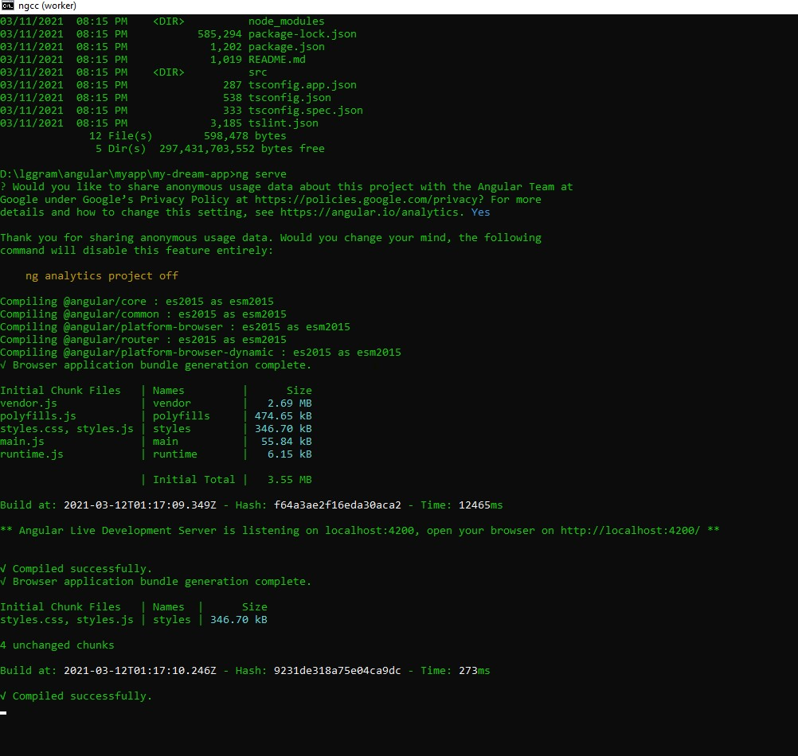
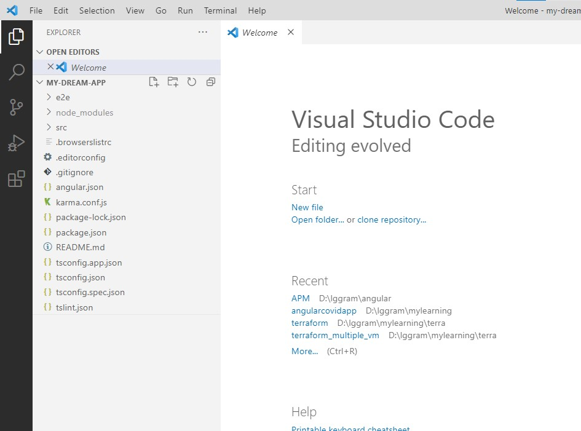
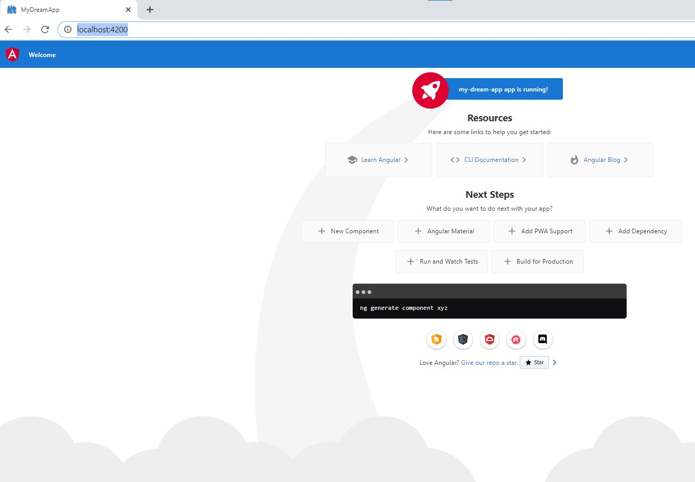

# Installation and Environment Setup


### How to install Node and NPM

- https://nodejs.org/en/
- go for latest stable version : https://nodejs.org/dist/v14.16.0/node-v14.16.0-x64.msi
- once installation is done you can check version:
```text
C:\Users\offic>node -v
v14.16.0

C:\Users\offic>npm -v
6.14.11

```
- NPM is installed alongwith nodeJS by default.

### How to install angular CLI

- go to here: https://cli.angular.io/
  
- run following commands:
```text
npm install -g @angular/cli

Note: -g: global
After cli is installed, we can check as follows: 

C:\Users\offic>ng
Available Commands:
  add Adds support for an external library to your project.
  analytics Configures the gathering of Angular CLI usage metrics. See https://angular.io/cli/usage-analytics-gathering.
  build (b) Compiles an Angular app into an output directory named dist/ at the given output path. Must be executed from within a workspace directory.
  deploy Invokes the deploy builder for a specified project or for the default project in the workspace.
  config Retrieves or sets Angular configuration values in the angular.json file for the workspace.
 

For more detailed help run "ng [command name] --help"

cd D:\lggram\angular\myapp

```
### Install first angular App
Run below commands to install new app: 
```text
ng new my-dream-app
cd my-dream-app
ng serve
```

You can access your first project here: http://localhost:4200/









### code commited here: https://github.com/njain51/my-dream-app/tree/1.0