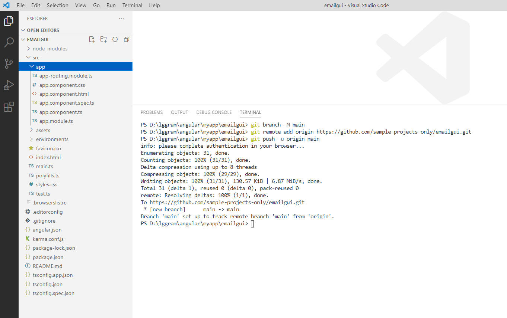
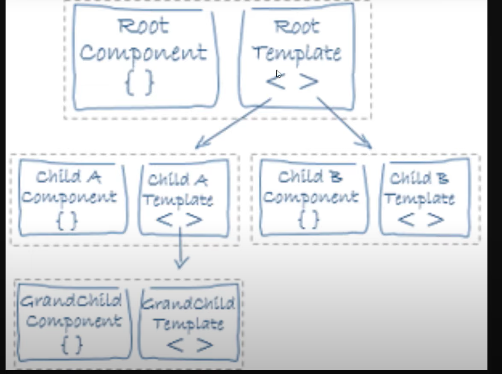

# Undestanding Angular Project Structure



### package.json

- app name, version, scripts, dependencies, devDependencies ( development dependencies)

### node_modules

-  all dependencies are downloaded here

### src folder: 

-  most of our work will be done here

### environments : 
- src\environments
- src\environments\environment.prod.ts
- src\environments\environment.ts
- we can add more environment files here basically to test our app in diffrenct environments. 

### assets
- src\assets
- some public files which are important but can be made public. 
- photos etc can come here 

### index.html
- src\index.html
- entry point of our app 
- this is first file which will load
- **body contains root component which will trnsform to html code dynamically.** 
- angular follows component based architecture so we can add many component here in <body> section 
- each component can contain static or dynamic component and can be used anywhere multiple times 

### main.js
- src\main.ts
- first entrypoint for Java Script in app 

### style.css
- src\styles.css
- for global styling

### app
- src\app
- root component

##### What is component? 


- it contains following files:
```text
src\app\app.component.ts
src\app\app.component.spec.ts
src\app\app.component.html
src\app\app.component.css


```
- instead of javascript we use typescript( It's kind of  javascript only but have more features)
- **Component basically represent small functionality** 
- it usually will have 4 files as above.

- src\app\app.component.html -> we will refer to as template, it contains component html code. 
- src\app\app.component.css -> each component will have its own css style component 
- src\app\app.component.ts -> component typescript , it determines dynamic content 
- src\app\app.component.spec.ts -> for component testing 


- module is bigger task which can have 4-5 components in it
- src\app\app.module.ts
- src\app\app-routing.module.ts  for routing.


### .editorconfig
- tells about which editor you using
- chracterset, indent etc. basically editor setting 

### karma.conf.js
- for unit testing

### package-lock.json
- keeps logs for package.json

### tslint.json
- helps doing validation , where to use arrow function etc. 

### typescript files
```text
tsconfig.spec.json
tsconfig.json
tsconfig.app.json
```
- base files to control editor and for auto intelligence 
- app file to control application


### e2e

- end to end testing 


