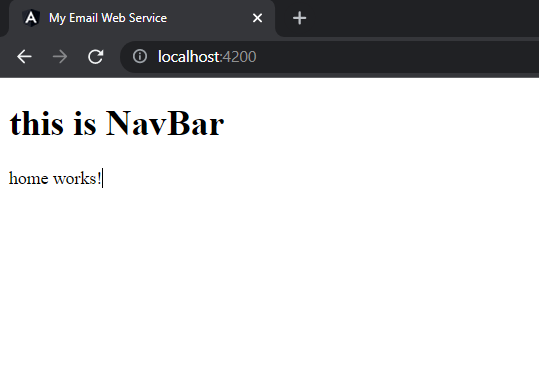

## add new component : home

```text
D:\lggram\angular\myapp\emailgui\src\app\components>ng g c home
CREATE src/app/components/home/home.component.html (19 bytes)
CREATE src/app/components/home/home.component.spec.ts (612 bytes)
CREATE src/app/components/home/home.component.ts (267 bytes)     
CREATE src/app/components/home/home.component.css (0 bytes)      
UPDATE src/app/app.module.ts (577 bytes)
```

- added <app-home> tag to reference new comonent in src\app\app.component.html
- following output will confirm its working:
- 