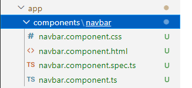
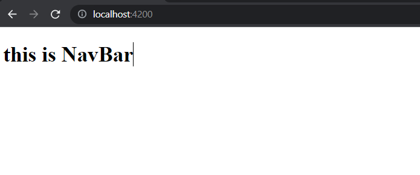

### adding new component

- created new dir components in app folder 
- create new component using : ng g component navbar
```text
PS D:\lggram\angular\myapp\emailgui> cd .\src\app\components\
PS D:\lggram\angular\myapp\emailgui\src\app\components> ng g component navbar
CREATE src/app/components/navbar/navbar.component.html (21 bytes)
CREATE src/app/components/navbar/navbar.component.spec.ts (626 bytes)
CREATE src/app/components/navbar/navbar.component.ts (275 bytes)     
CREATE src/app/components/navbar/navbar.component.css (0 bytes)      
UPDATE src/app/app.module.ts (486 bytes)
PS D:\lggram\angular\myapp\emailgui\src\app\components> 
```

following components created:


- note that src\app\app.module.ts will automatically add reffrence to newly created component: 
```text
import { NavbarComponent } from './components/navbar/navbar.component';
```

- now we will delete all html existing code from src\app\app.component.html and add our navbar component
- to do this first we need to check for selector of navbar component here: src\app\components\navbar\navbar.component.ts
- next we can add this component in src\app\app.component.html
```text
<app-navbar></app-navbar>
```

- So following component output is coming from navbar component:


 
[code for component addtion](https://github.com/sample-projects-only/emailgui/tree/1.0)