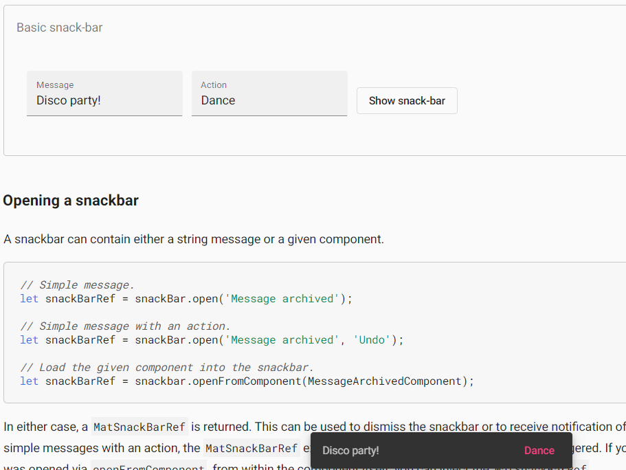
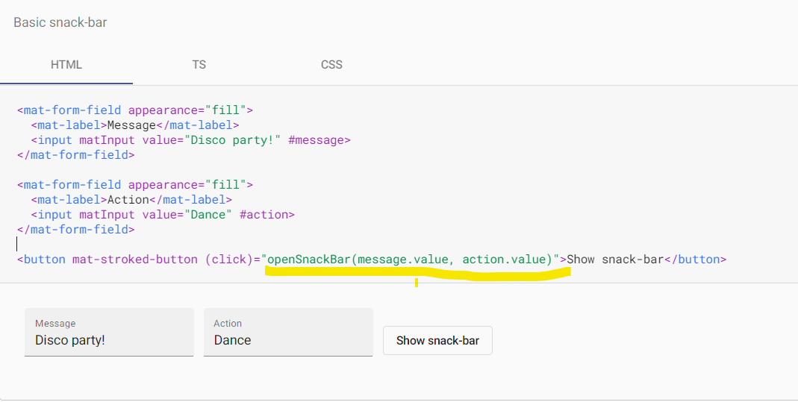
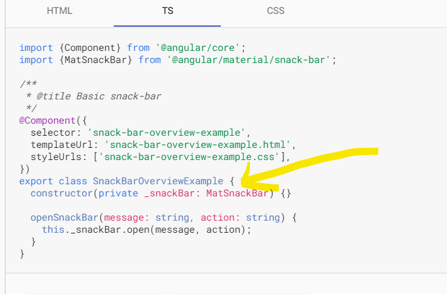
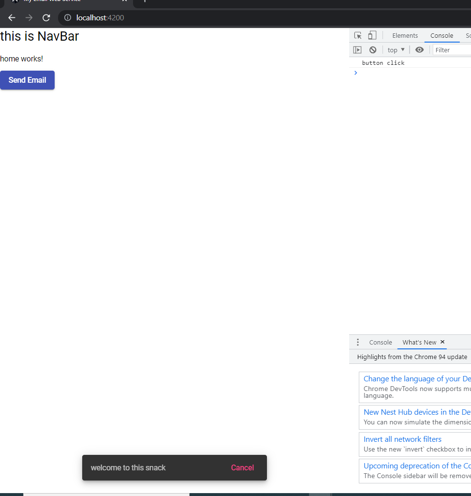

# Using snackbar from Material Library

- its a Service to dispatch Material Design snack bar messages.



- adding import module for snackbar API at src\app\app.module.ts
```text
import {MatSnackBarModule} from '@angular/material/snack-bar';
```
- and adding MatSnackBarModule in imports

- **now we are ready to use the service**
- From their doc we see they are calling a function with click event of button:



- this function reference  is coming from service declared in constructor:




- we will first register the service here src\app\app.module.ts: 
```text
import {MatSnackBar, MatSnackBarModule} from '@angular/material/snack-bar';
providers: [MatSnackBar],
```

- now we can use in any component 
- to use in home component, we will have to call refrence in contrusctor here: src\app\components\home\home.component.ts
```text
constructor(private _snackbar:MatSnackBar) { }

// _snackbar is  service variable and its of type MatSnackBar

```

- next we will create method as follows: 
```text
  // create a function and bind it with button call in html file 
  btnClick(){

    console.log("button click")
    this._snackbar.open("welcome to this snack", "Cancel");
  }
```

- use the btnClick function now in html 
```text
<button mat-raised-button color="primary"  (click)="btnClick()">Send Email</button>
```



[Reference Code here](https://github.com/sample-projects-only/emailgui/tree/3.0)