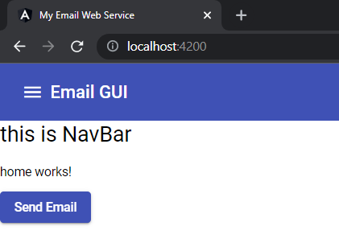

# Adding toolbar

[Reference](https://material.angular.io/components/toolbar/overview)


- adding API in src\app\app.module.ts
- added mat-toolbar in src\app\components\navbar\navbar.component.html

```text
<mat-toolbar color="primary">
    <button mat-icon-button class="example-icon" aria-label="Example icon-button with menu icon">
        <mat-icon>menu</mat-icon>
      </button>    
<span>Email GUI</span>

</mat-toolbar>
```



[code here](https://github.com/sample-projects-only/emailgui/tree/4.0)