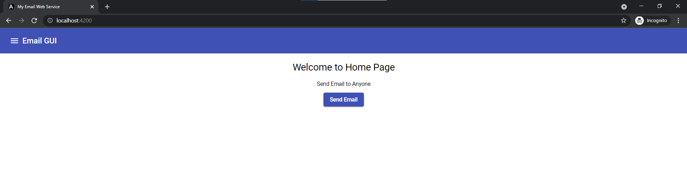

# Adding Home Component at centre

- src\app\components\home\home.component.html

```html
<div class="container">

    <h1>Welcome to Home Page</h1>
    <p> Send Email to Anyone</p>
    <button mat-raised-button color="primary"  (click)="btnClick()">Send Email</button>
</div>
```

- adding style to align in centre and add margin 

```css
.container {
    text-align: center;
    margin-top: 20px;
}
```


