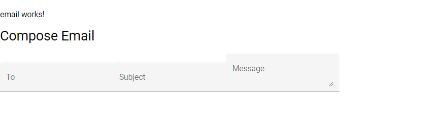
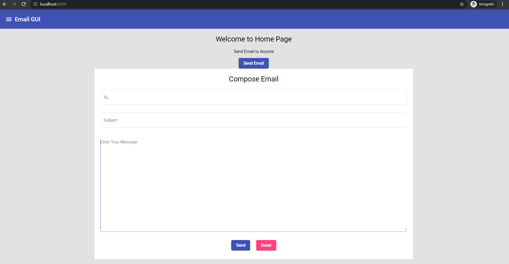

# Adding Form Template

- we need following Material modules: 
```text
import {MatFormFieldModule} from '@angular/material/form-field';
import {MatInputModule} from '@angular/material/input';

```

- create email component:
```text
D:\lggram\angular\myapp\emailgui\src\app\components>ng g c email 
CREATE src/app/components/email/email.component.html (20 bytes)
CREATE src/app/components/email/email.component.spec.ts (619 bytes)
CREATE src/app/components/email/email.component.ts (271 bytes)     
CREATE src/app/components/email/email.component.css (0 bytes)      
UPDATE src/app/app.module.ts (1132 bytes)
```

- next we make our chages to src\app\components\email\email.component.html
- added 2 div - one for container and other for card
```text
What is a card in CSS?
CSS cards are great for organizing and enhancing a website's user interface. Each card is uniquely designed to make it easy for users to read the card content
```

- added input field code for To, Subject and text area for Message ( can copy this code from form field [here](https://material.angular.io/components/form-field/overview)

- it will look as follows: 

- next we increase width of each field
- add class="field"  to each form-field and add following css:
```css
.field{
    width: 100%;
}
```
- reduce card width and use margin 
```css
.card{
    margin: auto;
    width: 60%;
}
```

- adding container top
```css
.container{
    top: 50px;
}
```

- increse height of text-area
```text
 <textarea rows="20" matInput></textarea>
```

- field type we can change to outline 
```text
<mat-form-field class="field" appearance="outline">
```

- added placeholder for text-area message 
- heading align in centre
```css
.card h1{
    text-align: center;
}

```

- adding card design 
```css
.card{
    margin: auto;
    width: 60%;
    background: white;
    padding: 20px;
}
```

- body color , change to be made here: src\styles.css
```css
body { margin: 0; font-family: Roboto, "Helvetica Neue", sans-serif;
       background:#e2e2e2;
    
}

```

- adding button 
```html
   <div class="text-center"> 
            <button type="submit" mat-raised-button color="primary">Send</button>
            <button type="submit" mat-raised-button color="accent">Reset</button>
           
           </div>
```

- bring button to center
```css
.text-center{
    text-align: center;
}
```

- adding margin to card button
```css
.card button{
    margin: 10px;
}
```

- Adding form tag , note that type submit should be inside form tag else functionality wont work as expected. 
```html
<form>
    
</form>
```


- our GUI is ready now and we can connect it with backend



[gui code here](https://github.com/sample-projects-only/emailgui/tree/5.1)
