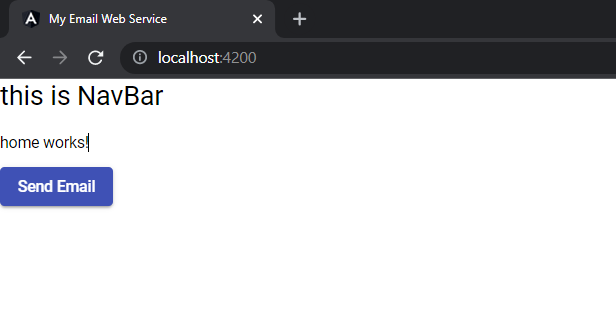

# Adding Angular Material Library

- this is very important librarty we can leverage for various inbuilt angular functions 
- it's documentation can be referenced from here: https://material.angular.io/
- in order to install just type following at command line: ng add @angular/material

output:
```text
D:\lggram\angular\myapp\emailgui\src\app\components>ng add @angular/material
ℹ Using package manager: npm
✔ Found compatible package version: @angular/material@12.2.10.
✔ Package information loaded.

The package @angular/material@12.2.10 will be installed and executed.
Would you like to proceed? Yes
✔ Package successfully installed.
? Choose a prebuilt theme name, or "custom" for a custom theme: Indigo/Pink        [ Preview: https://material.angular.io?theme=indigo-pink ]
? Set up global Angular Material typography styles? Yes 
? Set up browser animations for Angular Material? Yes
UPDATE package.json (1140 bytes)
✔ Packages installed successfully.
UPDATE src/app/app.module.ts (686 bytes)
UPDATE angular.json (3287 bytes) 
UPDATE src/index.html (591 bytes)
UPDATE src/styles.css (181 bytes)
```

Also note:
```text
The ng add command will additionally perform the following actions:

Add project dependencies to package.json
Add the Roboto font to your index.html
Add the Material Design icon font to your index.html
Add a few global CSS styles to:
Remove margins from body
Set height: 100% on html and body
Set Roboto as the default application font
```

- There are so many components we can use from here:https://material.angular.io/components/categories

## Testing

- lets say we want to create button using material library
- add following import statement to src\app\app.module.ts and also add MatButtonModule to imports
```text
https://material.angular.io/components/button/overview 
```

- next we will add button to src\app\components\home\home.component.html by adding following code: 
```text
<button mat-raised-button color="primary">Send Email</button>
```

- after restart of ng server, output will be as follows: 



 [button code added here](https://github.com/sample-projects-only/emailgui/tree/2.0)