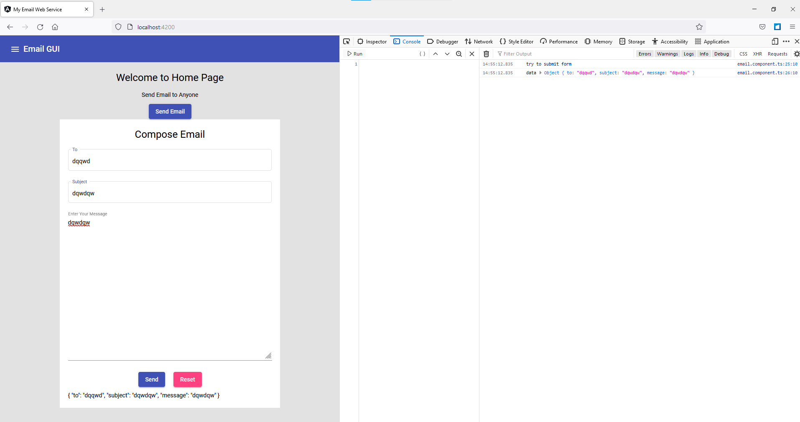

# Connecting Email to Backend 


src\app\components\email\email.component.ts
```typescript
 doSubmitForm()
  {
  console.log("try to submit form")
  console.log("data", this.data)
  }

```
- we are able to retrive data in log



- next we want to send data to our backend service, so we will create another service which will call our backend and we will call that service in our doSubmitForm() method

```text
D:\lggram\angular\myapp\emailgui\src\app\components>cd ..

D:\lggram\angular\myapp\emailgui\src\app>mkdir service

D:\lggram\angular\myapp\emailgui\src\app>cd service

D:\lggram\angular\myapp\emailgui\src\app\service>ng g service email
CREATE src/app/service/email.service.spec.ts (352 bytes)
CREATE src/app/service/email.service.ts (134 bytes)

D:\lggram\angular\myapp\emailgui\src\app\service>

```

- add EmailService in Provider if not already added src\app\app.module.ts
- write code to send data to api
src\app\service\email.service.ts
```text
  // write code here for calling backend service 
  private baseUrl:String ="http://localhost:8080"

  constructor(private http:HttpClient) {
   }
  

  sendEmail(data: any){

    return this.http.post(`${this.baseUrl}/sendemail`,data);

  }
```

- sendEmail is returning data so when we call this method in email.component.ts then it will be consumer which will need to subscribe to this data. 
- 
- next we will call this sendEmail() method at src\app\components\email\email.component.ts

```text
What is observable and subscribe in angular?
Observables are declarative—that is, you define a function for publishing values, but it is not executed until a consumer subscribes to it. The subscribed consumer then receives notifications until the function completes, or until they unsubscribe.
```

src\app\components\email\email.component.ts
```text
this.email.sendEmail(this.data).subscribe(
    response=>{
      console.log(response);   
 
      this._snackbar.open("Send Success ","OK")  
    },
    error=>{
      console.log(error); 
     
      this._snackbar.open("ERROR!! ","OK")   
    }
  )  
```

- make sure there is correct mapping for json data posted. 

- next we will do testing for our code
