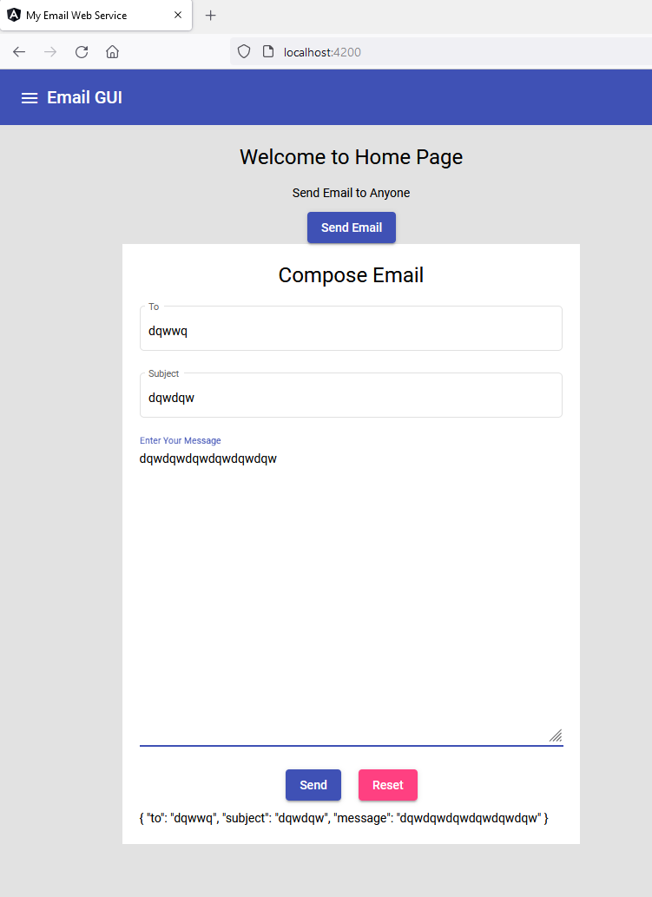

# Connecting email service with backend 

- we will use following backend service to connect with our application

- https://github.com/sample-projects-only/emailapi

- Testing :
```json
curl --location --request POST 'http://localhost:8080/sendemail' \
--header 'Content-Type: application/json' \
--data-raw '{
    "subject" : "test subject only final",
     "message": "test message",
     "recipent_add" : "official.nitinjain@gmail.com",
     "sender_add" : "nitin.ibm2006@gmail.com"
}'
```

0utput:
```text
Email is sent successfully ..
```

- so api call is working via postman, now we will connect it to our frontend app

- adding (ngSubmit) directive to form and calling doSubmitForm() function to do our job
```text
ngSubmit, and it seems to be doing exactly the same as submit at a first glance. However, ngSubmit ensures that the form doesn’t submit when the handler code throws (which is the default behaviour of submit) and causes an actual http post request. Let’s use ngSubmit instead as this is the best practice:
```

```text
<form (submit)="doSubmitForm()">

note: (ngSubmit) not working currently with any browser to print console message. 
Even tried with ng serve --disable-host-check

```
- added function body here: src\app\components\email\email.component.ts
```text
  doSubmitForm(){
    console.log("form is submitted");
  }
```

- so next we need to enhance our function and data we are submitting must be stored somewhere. 
- so we will create data object in src\app\components\email\email.component.ts and use **property binding and event binding** together.

src\app\components\email\email.component.ts
```javascript
  data = {

    to : "",
    subject:"",
    message:""

  }
```

- added forms module
```text
import { FormsModule } from '@angular/forms';
```

- added two way binding to html
```html
<div class="container">
    <div class="card">

      <!-- <form (ngSubmit)="doSubmitForm()"> -->
        <form (ngSubmit)="doSubmitForm()">

        <h1>Compose Email</h1>

        <mat-form-field class="field" appearance="outline">
            <mat-label>To</mat-label>
            <input name="to" [(ngModel)]="data.to" matInput>
          </mat-form-field>
        
          <mat-form-field class="field" appearance="outline">
            <mat-label>Subject</mat-label>
            <input matInput name="subject" [(ngModel)]="data.subject">
          </mat-form-field>
          
          
          <mat-form-field class="example-full-width field" >
            <mat-label>Enter Your Message</mat-label>
            <textarea rows="20" name="message" [(ngModel)]="data.message" matInput placeholder="Hey, What are you doing guys !!"></textarea>
          </mat-form-field>


          <div class="text-center"> 
            <button type="submit" mat-raised-button color="primary">Send</button>
            <button type="reset" mat-raised-button color="accent">Reset</button>
           
           </div>

         
          </form>

      {{data | json}}

    </div>
</div>
```



[code here](https://github.com/sample-projects-only/emailgui/tree/6.0)