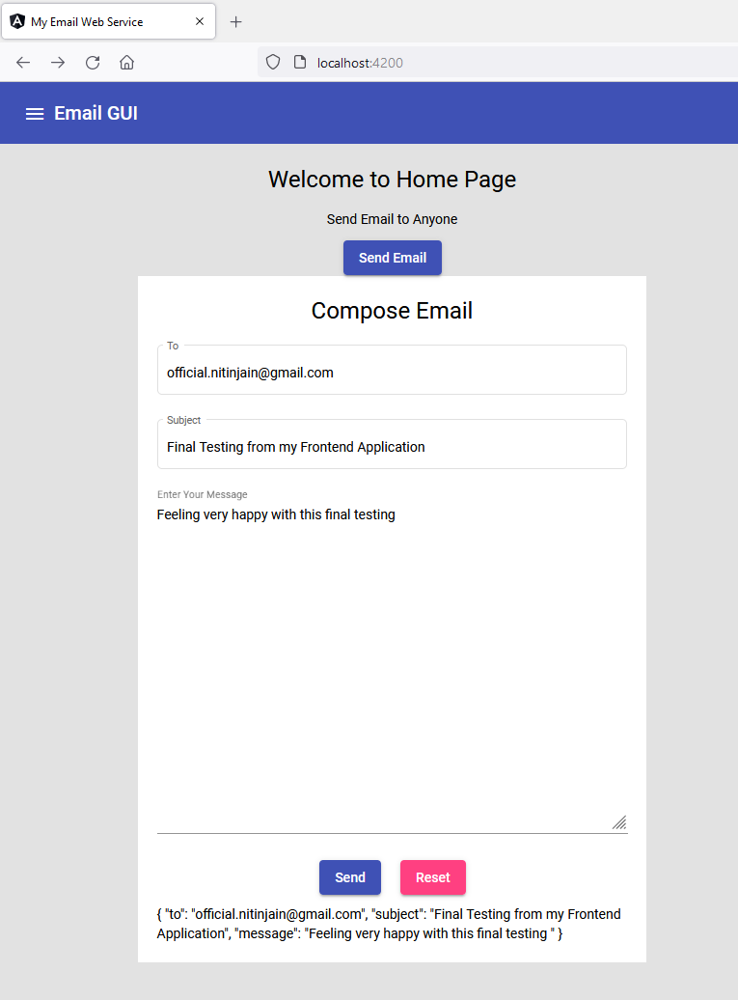
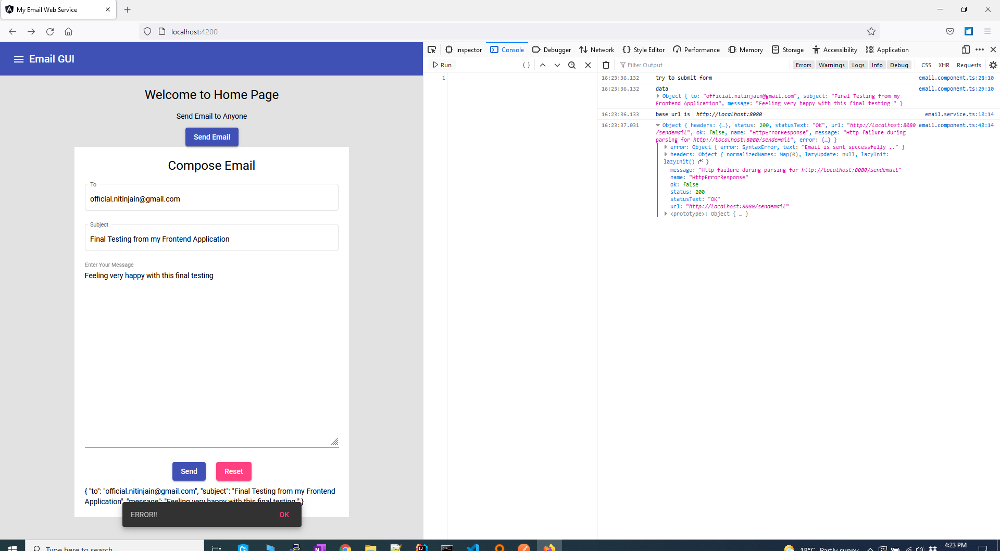
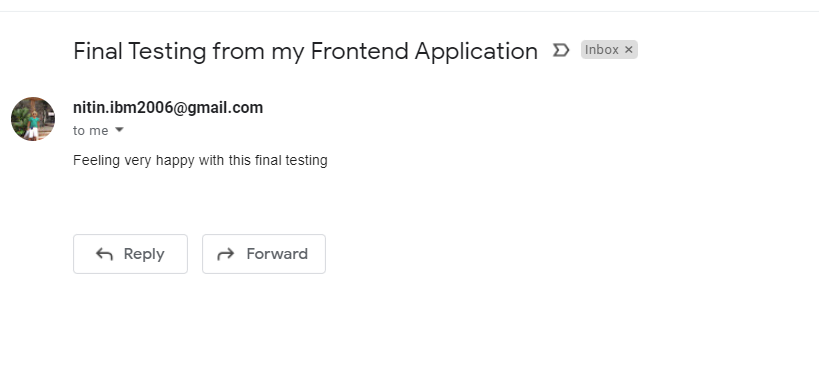

## Testing my Frontend working with Backend

- ng serve



- json data at bottom confirms data binding is correct
- after we click on submit: 



- Logs from backend Springboot application:
```text
DEBUG SMTP: AUTH LOGIN command trace suppressed
DEBUG SMTP: AUTH LOGIN succeeded
DEBUG SMTP: use8bit false
MAIL FROM:<nitin.ibm2006@gmail.com>
250 2.1.0 OK c6sm5641445qkg.85 - gsmtp
RCPT TO:<official.nitinjain@gmail.com>
250 2.1.5 OK c6sm5641445qkg.85 - gsmtp
DEBUG SMTP: Verified Addresses
DEBUG SMTP:   official.nitinjain@gmail.com
DATA
354  Go ahead c6sm5641445qkg.85 - gsmtp
Date: Sun, 17 Oct 2021 16:23:36 -0400 (EDT)
From: nitin.ibm2006@gmail.com
To: official.nitinjain@gmail.com
Message-ID: <978664999.3.1634502216156@host.docker.internal>
Subject: Final Testing from my Frontend Application
MIME-Version: 1.0
Content-Type: text/plain; charset=us-ascii
Content-Transfer-Encoding: 7bit

Feeling very happy with this final testing 
.
250 2.0.0 OK  1634502218 c6sm5641445qkg.85 - gsmtp
DEBUG SMTP: message successfully delivered to mail server
QUIT
221 2.0.0 closing connection c6sm5641445qkg.85 - gsmtp
Message sent successfully
```

- email received


[code available here] (https://github.com/sample-projects-only/emailgui/tree/7.0)
